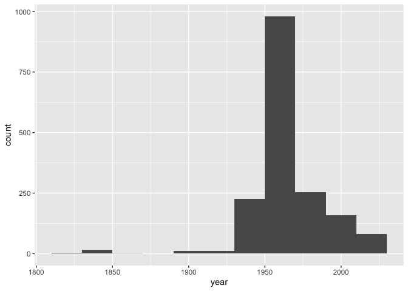

Lab 08 - University of Edinburgh Art Collection
================
Cailey Fay
3.17.26

## Load Packages and Data

First, let’s load the necessary packages:

``` r
library(tidyverse) 
library(skimr)
library(robotstxt)
```

## Getting Started

``` r
paths_allowed("https://collections.ed.ac.uk/art)")
```

    ##  collections.ed.ac.uk

    ## [1] TRUE

## Excercises 1-9: Creating the function and automating

``` r
source("scripts/01-scrape-page-one.R")
```

    ## 
    ## Attaching package: 'rvest'

    ## The following object is masked from 'package:readr':
    ## 
    ##     guess_encoding

``` r
source("scripts/02-scrape-page-function.R")
source("scripts/03-scrape-page-many.R")
```

Now, load the dataset. \*\*when I source above, it includes the
dataframe that was created with all of the info, so I will be using
that, but this code does work if I were so inclined to use it.

`{#r load-data, message = FALSE, eval = TRUE} uoe_art <- read_csv("data/uoe-art.csv")`

## Exercise 10

Let’s start working with the **title** column by separating the title
and the date:  
The warning is just saying that pieces without the date in the format we
are expecting are assigned NAs.

``` r
auto <- auto %>%
  separate(title, into = c("title", "date"), sep = "\\(") %>%
  mutate(year = str_remove(date, "\\)") %>% as.numeric()) %>%
  select(title, artist, year, link)  # Fill in the missing variable!
```

    ## Warning: Expected 2 pieces. Additional pieces discarded in 58 rows [122, 130, 137, 172,
    ## 179, 189, 191, 192, 216, 217, 271, 301, 342, 356, 405, 480, 483, 535, 680, 763,
    ## ...].

    ## Warning: Expected 2 pieces. Missing pieces filled with `NA` in 598 rows [3, 8, 9, 10,
    ## 17, 18, 19, 23, 33, 41, 43, 45, 59, 77, 81, 83, 84, 85, 86, 90, ...].

    ## Warning: There was 1 warning in `mutate()`.
    ## ℹ In argument: `year = str_remove(date, "\\)") %>% as.numeric()`.
    ## Caused by warning in `str_remove(date, "\\)") %>% as.numeric()`:
    ## ! NAs introduced by coercion

## Exercise 11

There are 108 pieces with missing artists and 1574 with missing dates.

``` r
skim(auto)
```

|                                                  |      |
|:-------------------------------------------------|:-----|
| Name                                             | auto |
| Number of rows                                   | 3320 |
| Number of columns                                | 4    |
| \_\_\_\_\_\_\_\_\_\_\_\_\_\_\_\_\_\_\_\_\_\_\_   |      |
| Column type frequency:                           |      |
| character                                        | 3    |
| numeric                                          | 1    |
| \_\_\_\_\_\_\_\_\_\_\_\_\_\_\_\_\_\_\_\_\_\_\_\_ |      |
| Group variables                                  | None |

Data summary

**Variable type: character**

| skim_variable | n_missing | complete_rate | min | max | empty | n_unique | whitespace |
|:--------------|----------:|--------------:|----:|----:|------:|---------:|-----------:|
| title         |         0 |          1.00 |   0 | 282 |     1 |     1635 |          0 |
| artist        |       108 |          0.97 |   2 |  55 |     0 |     1202 |          0 |
| link          |         0 |          1.00 |  45 |  48 |     0 |     3320 |          0 |

**Variable type: numeric**

| skim_variable | n_missing | complete_rate |    mean |   sd |  p0 |  p25 |  p50 |  p75 | p100 | hist  |
|:--------------|----------:|--------------:|--------:|-----:|----:|-----:|-----:|-----:|-----:|:------|
| year          |      1574 |          0.53 | 1964.75 | 53.1 |   2 | 1953 | 1962 | 1978 | 2024 | ▁▁▁▁▇ |

## Exercise 12

There was a painting with year = 2, which I filtered out so that the
histogram was more interpretable. Otherwise, it looks like most of the
paintings are from 1950 onward.

``` r
auto %>%
  filter(year > 2) %>%
ggplot(mapping = aes(x=year)) +
  geom_histogram(binwidth = 20)
```

<!-- -->

## Exercise 13

Death Mask by H. Dempshall was assigned year = 2. It was actually made
in 1964, but in the title, there is a (2) before the (1964). Now it is
fixed.

``` r
auto<- auto %>%
  mutate(year = case_when(
    year == 2 ~ 1964,
    TRUE ~ year
  ))
```

## Exercise 14

There are 371 unknown artists. After that, the artist with the most
pieces is Emma Gillies, with 174. I don’t know them.

``` r
auto %>%
  count(artist) %>%
  arrange(desc(n))
```

    ## # A tibble: 1,203 × 2
    ##    artist               n
    ##    <chr>            <int>
    ##  1 Unknown            371
    ##  2 Emma Gillies       174
    ##  3 <NA>               108
    ##  4 Ann F Ward          23
    ##  5 John Bellany        22
    ##  6 Zygmunt Bukowski    21
    ##  7 Boris Bućan         17
    ##  8 Marjorie Wallace    17
    ##  9 Gordon Bryce        16
    ## 10 William Gillon      16
    ## # ℹ 1,193 more rows

## Exercise 15

There are 11 pieces with child in the title. The website search says
there are 43, but only 11 show up in my frame when I manually search.

``` r
child <- str_detect(auto$title, "Child")
table(child)
```

    ## child
    ## FALSE  TRUE 
    ##  3309    11
